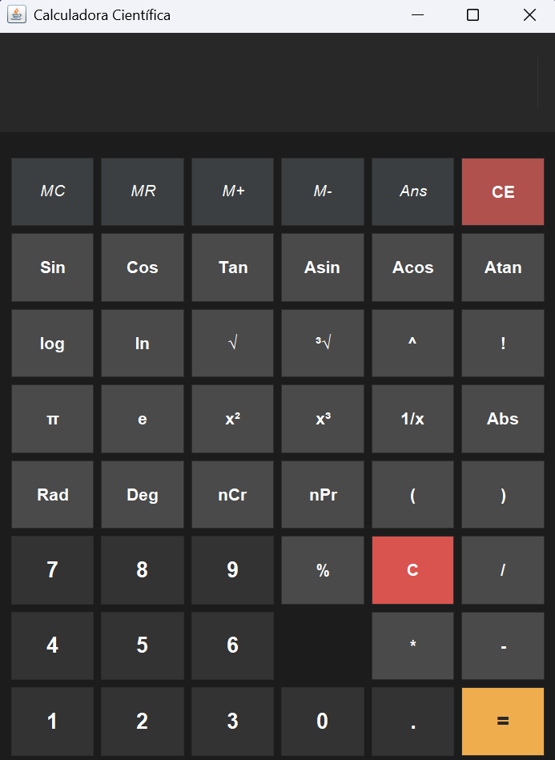

# 🧮 Calculadora Científica

Calculadora científica de escritorio, desarrollada en **Java** utilizando la librería gráfica **Swing**. 
Cuenta con un motor de evaluación de expresiones matemáticas que permite resolver ecuaciones complejas 
respetando la jerarquía de operaciones, uso de paréntesis, funciones trigonométricas, combinatoria y un sistema de memoria integrado.

---

## 🚀 Características principales

- **Diseño Moderno:** Interfaz estilizada en *Dark Mode* (Modo Oscuro) con distribución intuitiva inspirada en las calculadoras científicas físicas.
- **Efectos Visuales:** Botones interactivos con efecto *hover* (cambio de brillo al pasar el cursor).
- **Motor de Expresiones:** Capacidad de escribir fórmulas completas en pantalla de una sola vez (ej: `2*(3+5)`).
- **Funciones Científicas Avanzadas:**
  - Trigonométricas e Inversas: `Sin`, `Cos`, `Tan`, `Asin`, `Acos`, `Atan`.
  - Logaritmos: `log` (base 10) y `ln` (logaritmo natural).
  - Raíces y Potencias: Cuadrado (`x²`), Cubo (`x³`), Potencia general (`^`), Raíz cuadrada (`√`) y Raíz cúbica (`³√`).
  - Avanzadas: Factorial (`!`), Valor Absoluto (`Abs`), Porcentaje (`%`) y Fracciones (`1/x`).
  - Estadística: Combinaciones (`nCr`) y Permutaciones (`nPr`).
- **Constantes Matemáticas:** Accesos directos para $\pi$ (`pi`) y el número de Euler (`e`).
- **Sistema de Memoria y Estado:** Botones de memoria clásica (`MC`, `MR`, `M+`, `M-`) y almacenamiento del último resultado (`Ans`).
- **Conversión de Ángulos:** Conversión directa entre Grados (`Deg`) y Radianes (`Rad`).

---

## 🛠️ Tecnologías utilizadas

- **Lenguaje:** Java (JDK 17 o superior recomendado)
- **Interfaz Gráfica:** Java Swing & AWT
- **Editor:** Visual Studio Code

---

## 💻 Cómo compilar y ejecutar el proyecto

### Requisitos previos
Tener instalado el **Java Development Kit (JDK)** y configuradas las variables de entorno en tu sistema.

### 1. Clonar el repositorio
```bash
git clone [https://github.com/Maicol843/Calculadora.git](https://github.com/Maicol843/Calculadora.git)
cd main
```
### 2. Compilar el código fuente
Abrí tu terminal y ejecutá:
```bash
javac CalculadoraCientifica.java
```
### 3. Ejecutar desde la consola
```bash
java CalculadoraCientifica
```

---

## 📦 Cómo generar la aplicación de escritorio (.jar ejecutable)

Si querés generar el archivo ejecutable para usarlo con doble clic en tu computadora, ejecutá los siguientes 
comandos en tu terminal según tu sistema operativo:
En Windows (PowerShell):
```bash
# 1. Crear el archivo de manifiesto
Set-Content manifest.txt "Main-Class: CalculadoraCientifica"

# 2. Empaquetar el ejecutable
jar cvfm Calculadora.jar manifest.txt CalculadoraCientifica*.class
```
En Linux / macOS / Windows (CMD):
```bash
# 1. Crear el archivo de manifiesto
echo Main-Class: CalculadoraCientifica> manifest.txt

# 2. Empaquetar el ejecutable
jar cvfm Calculadora.jar manifest.txt CalculadoraCientifica*.class
```

---

## 👤 Autor
Maicol Daniel Mamani Chalco / Maicol843 - https://github.com/Maicol843/

Proyecto desarrollado con fines educativos de nivel inicial/intermedio en Java. ¡Si te gustó, dejale una ⭐️ al repositorio!

---

<div align="center">
  
</div>
